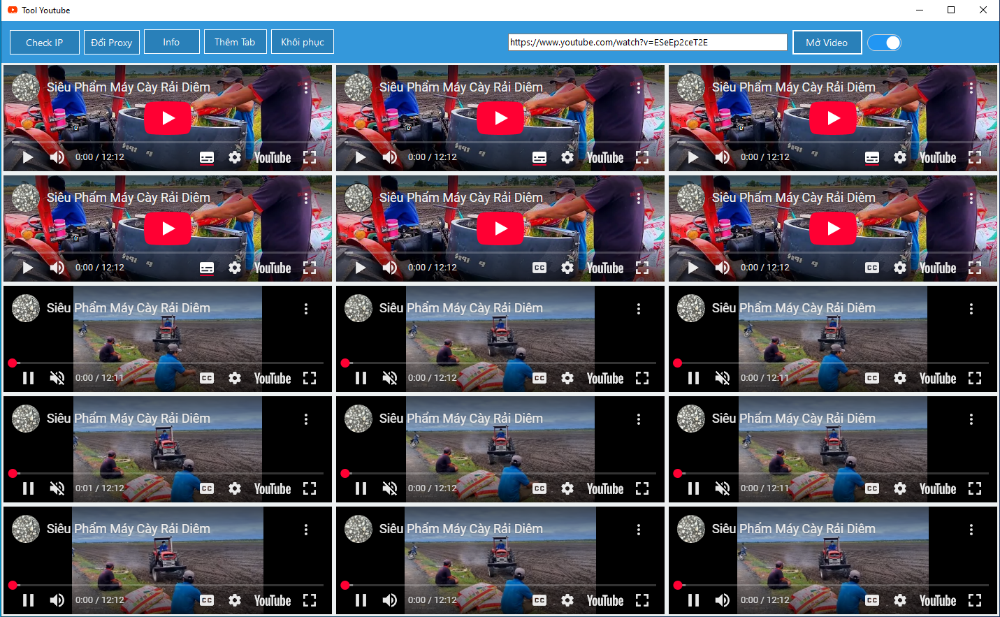

# Tool Tăng Lượt Xem YouTube

## Giới thiệu
Tool Tăng Lượt Xem YouTube được phát triển bằng C# giúp tăng lượt xem video một cách tự động bằng cách mở nhiều tab YouTube và chạy video đồng thời. Công cụ này hỗ trợ đổi Proxy, kiểm tra IP, thêm tab mới, và khôi phục các phiên xem.

## Chức năng chính
- **Check IP**: Kiểm tra địa chỉ IP hiện tại để đảm bảo việc đổi Proxy hoạt động hiệu quả.
- **Đổi Proxy**: Thay đổi Proxy giúp tránh bị YouTube phát hiện và hạn chế lượt xem.
- **Thêm Tab**: Mở thêm nhiều tab YouTube chạy video cùng lúc để tăng lượt xem.
- **Khôi phục**: Tự động khôi phục các tab nếu bị lỗi hoặc bị đóng.
- **Mở Video**: Cho phép nhập URL video YouTube để bắt đầu xem. Các tab đều mở cùng lúc video đó!

## Hướng dẫn sử dụng
1. **Tải về và cài đặt**:
   - Tải tool về máy và chạy file `ToolYoutube.msi` để khởi động.

   
   
3. **Cấu hình và sử dụng**:
   - Mở tool và nhập link video YouTube vào ô URL.
   - Nhấn **"Mở Video"** để chạy video trên nhiều tab.
   - Sử dụng nút **"Thêm Tab"** để mở thêm nhiều phiên xem.
   - Nhấn **"Đổi Proxy"** để thay đổi IP, tránh bị phát hiện.
   - Nếu có lỗi, nhấn **"Khôi phục"** để reset các tab.

4. **Lưu ý**:
   - Sử dụng proxy chất lượng để tránh bị YouTube phát hiện.
   - Không nên chạy quá nhiều tab cùng lúc để tránh quá tải hệ thống.
   - Kiểm tra IP thường xuyên để đảm bảo các lượt xem hợp lệ.

## Ảnh màn hình
Dưới đây là ảnh chụp màn hình giao diện của tool:

## Video hướng dẫn sử dụng
Xem hướng dẫn chi tiết cách sử dụng tool trên YouTube:  
🔗 [Hướng dẫn sử dụng Tool Tăng View YouTube](https://youtu.be/5Itg9VTHB1c)

## Yêu cầu hệ thống
- Windows 7/8/10/11 (64-bit)
- .NET Framework 4.7 trở lên
- Kết nối internet ổn định

## Tác giả

  

  <b>Lý Trần</b>

   <b>Liên hệ: https://zalo.me/+84876437046</b>

 <b>--------------------------------------------------</b>

Cảm ơn bạn đã sử dụng Tool Tăng Lượt Xem YouTube! Nếu có bất kỳ vấn đề hoặc câu hỏi nào, hãy liên hệ qua Zalo.
